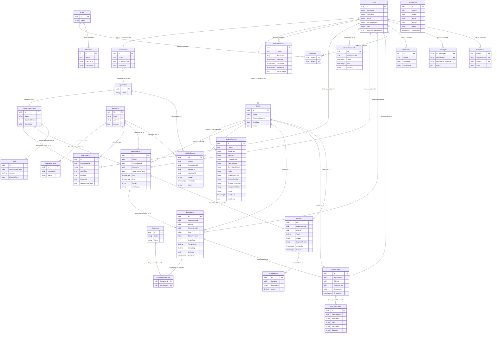

# Arquitectura de la base

Una sola base PostgreSQL por consultorio (`clinica` en local). El modelo sale de `TenantDbContext` y del snapshot de migraciones.

Las líneas sólidas del diagrama son claves foráneas de verdad. El resto son columnas `uuid` que apuntan a otra tabla, pero **no** tienen FK en la base: la integridad la mantiene la aplicación.

## Diagrama

`AuditEntries` no se une con línea: `UserId` y `EntityId` son de auditoría, sin FK. `RefreshSessions.ReplacedById` apunta a otra sesión de la misma tabla, también sin FK.

## Dominio clínico

| Tabla | Clave | Columnas que apuntan a otra tabla | Restricción real |
|---|---|---|---|
| `Locations` | `Id` | — | — |
| `MedicalServices` | `Id` | `LocationId` → `Locations` | ninguna |
| `Specialties` | `Id` | — | `Name` único |
| `AppointmentTypes` | `Id` | `SpecialtyId?` → `Specialties` | ninguna |
| `ScheduleBlocks` | `Id` | `ProfessionalId` → `Users`, `LocationId` → `Locations`, `AppointmentTypeId` → `AppointmentTypes` | índice en `ProfessionalId` |
| `ScheduleBlockouts` | `Id` | `ProfessionalId` → `Users` | ninguna |
| `Employees` | `Id` | `UserId` → `Users`, `SpecialtyId?` → `Specialties` | FK `UserId` cascade, índice único (1:1). FK `SpecialtyId` set null |
| `Clients` | `Id` | `UserId` → `Users` | FK `UserId` cascade, índice único (1:1) |
| `MedicalRecords` | `Id` | `ClientId` → `Clients`, `UpdatedBy?` → `Users` | FK `ClientId` cascade, índice único (1:1) |
| `Appointments` | `Id` | `ClientId` → `Clients`, `ProfessionalId`, `LocationId`, `AppointmentTypeId` | FK `ClientId` cascade. Índice `(ProfessionalId, Start)` |
| `WaitlistEntries` | `Id` | `ClientId`, `ProfessionalId?`, `LocationId`, `SpecialtyId` | ninguna |
| `Diagnoses` | `Id` | — | `Code` único |
| `Encounters` | `Id` | `AppointmentId`, `ClientId`, `ProfessionalId` | `AppointmentId` único (1:1 lógico) |
| `EncounterDiagnoses` | `(EncounterId, DiagnosisId)` | ambas columnas | FK cascade a `Encounters` y a `Diagnoses` |
| `Prescriptions` | `Id` | `EncounterId`, `ClientId`, `ProfessionalId` | ninguna |
| `PrescriptionItems` | `Id` | `PrescriptionId` | FK cascade a `Prescriptions` |
| `Fees` | `Id` | `AppointmentTypeId` | ninguna |
| `Invoices` | `Id` | `AppointmentId`, `ClientId` | `AppointmentId` único (1:1 lógico) |
| `InvoiceItems` | `Id` | `InvoiceId` | FK cascade a `Invoices` |
| `AuditEntries` | `Id` | `UserId?` (sin tabla forzada) | índice en `Timestamp` |

`ProfessionalId` es siempre el `Id` de un usuario con rol médico (`Users`), no una tabla de profesionales.

## Identidad

`Users` es la cuenta. Guarda nombre, apellido, el rol de la clínica (`TenantAdmin`, `Doctor`, `Secretary`, `Patient`) y las columnas de acceso: contraseña, bloqueo, confirmación de email y teléfono.

El nombre visible no es una columna. `TenantUser.Name` lo proyecta como `FirstName` + `LastName`. Identity sigue guardando `UserName` y `NormalizedUserName` con el email, porque el login lo exige; no es un dato del dominio.

Un usuario es empleado o cliente, nunca las dos cosas. `Employees` tiene la matrícula y la especialidad. `Clients` tiene documento, nacimiento y teléfono. El rol distingue admin, médico y secretaria dentro de los empleados.

`Roles` y `UserRoles` son el catálogo de Identity. Conviven con la columna `Users.Role`: esa columna es la que usa la aplicación.

| Tabla | Relación |
|---|---|
| `RefreshSessions` | N sesiones por usuario. FK `UserId` cascade. `ReplacedById` encadena la rotación del refresh token, sin FK. |
| `Roles` / `UserRoles` | qué roles de Identity tiene cada usuario |
| `UserClaims`, `UserLogins`, `UserTokens`, `RoleClaims` | claims, logins externos y tokens, todas con FK cascade |

## Cardinalidades que importan

- Un usuario tiene como máximo un empleado o un cliente (`Employees.UserId` y `Clients.UserId` únicos).
- La especialidad del médico está en `Employees.SpecialtyId`.
- Un cliente tiene exactamente una historia clínica (`MedicalRecords.ClientId` único + FK).
- Los turnos apuntan al cliente (`Appointments.ClientId`).
- Un turno tiene como máximo un encuentro y como máximo una factura (índices únicos, sin FK).
- Un encuentro tiene muchos diagnósticos a través de `EncounterDiagnoses`.
- Una receta tiene muchos ítems; una factura tiene muchos ítems. Esas dos sí borran en cascada.
